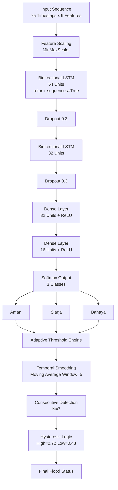

<div align="center">
  
</div>

<h1 align="center">
  SIABAN - Sistem Informasi Deteksi Banjir Cerdas
</h1>

<p align="center">
  Platform monitoring dan peringatan dini banjir berbasis Web dan Deep Learning (LSTM) untuk Desa Sukarami. Proyek ini mengintegrasikan pemantauan sensor realtime, prediksi risiko cerdas, dan manajemen pengguna yang komprehensif.
</p>

---

## Architecture

SIABAN menggunakan arsitektur hybrid yang menggabungkan framework **Laravel 11** untuk manajemen sistem dan **FastAPI** untuk layanan inferensi Deep Learning berbasis **Ordinal Bidirectional LSTM**.

### LSTM Model Architecture


### System Workflow
1.  **Sensor Data Collection**: Pengumpulan data sensor (tinggi air, curah hujan) secara realtime.
2.  **AI Inference Service**: Data dikirim ke API FastAPI untuk diprediksi menggunakan model Bi-LSTM Ordinal.
3.  **Realtime Monitoring Dashboard**: Visualisasi data sensor dan status peringatan dini melalui dashboard Laravel.
4.  **Role-Based Management**: Pengaturan hak akses (Admin, Staff, Warga) untuk kontrol fungsionalitas sistem.
5.  **Historical Data Archiving**: Penyimpanan dan pengelolaan histori data untuk analisis jangka panjang.
6.  **Responsive Interface**: Antarmuka modern yang dioptimalkan untuk berbagai perangkat tanpa hambatan navigasi.

---

## Key Features

-   **Intelligent Flood Prediction**: Prediksi status Aman, Siaga, atau Bahaya dengan akurasi tinggi menggunakan ordinal learning.
-   **Realtime Monitoring**: Dashboard dinamis untuk memantau ketinggian air dan kondisi lingkungan saat ini.
-   **Comprehensive User Management**: Halaman manajemen user (Tambah/Edit) yang terdedikasi untuk kontrol hak akses Admin dan Staff.
-   **Interactive Data Graphics**: Visualisasi grafik data historis untuk memantau tren kenaikan air secara temporal.
-   **Enhanced UX/UI**: Antarmuka bersih, cepat, dan responsif dengan fitur toggle visibilitas password di semua form autentikasi.

---

## Tech Stack

| Component       | Technology                                                                                             |
|---------------|-------------------------------------------------------------------------------------------------------|
| **Web Framework** |    |
| **Deep Learning** |    |
| **Backend API**   |   **Uvicorn** |
| **Database**      |   |

---

## Installation & Usage

### 1. Web Application Setup (Laravel)

1.  **Clone the repository**:
    ```bash
    git clone https://github.com/akariwill/siaban.git
    cd siaban
    ```

2.  **Install dependencies**:
    ```bash
    composer install
    npm install && npm run build
    ```

3.  **Environment configuration**:
    ```bash
    cp .env.example .env
    php artisan key:generate
    ```

4.  **Database migration**:
    ```bash
    php artisan migrate --seed
    ```

5.  **Run server**:
    ```bash
    php artisan serve && npm run dev
    ```

### 2. AI Inference API Setup (FastAPI)

1.  **Navigate to API directory**:
    ```bash
    cd api
    ```

2.  **Install requirements**:
    ```bash
    pip install -r requirements.txt
    ```

3.  **Run FastAPI server**:
    ```bash
    uvicorn app:app --reload --host 0.0.0.0 --port 8000
    ```

---

## Project Structure

```
siaban/
├── app/                    # Laravel Core Logic (Controllers, Models, Services)
├── api/                    # AI Inference Service (FastAPI)
├── bootstrap/              # Framework Bootstrapping
├── config/                 # Application Configuration
├── database/               # Migrations & Seeders
├── public/                 # Web Assets & Entry Point
├── resources/              # Frontend Views (Blade, Tailwind, JS)
├── routes/                 # Web & Auth Routes
├── storage/                # Logs & App Data
└── tests/                  # Application Testing
```

---

## License

This project is licensed under the [MIT License](LICENSE).

---

## Credits & Contact

- **Author**: [akariwill](https://github.com/akariwill)
- **Discord**: `akariwill_` | **Instagram**: `@akariwill`
